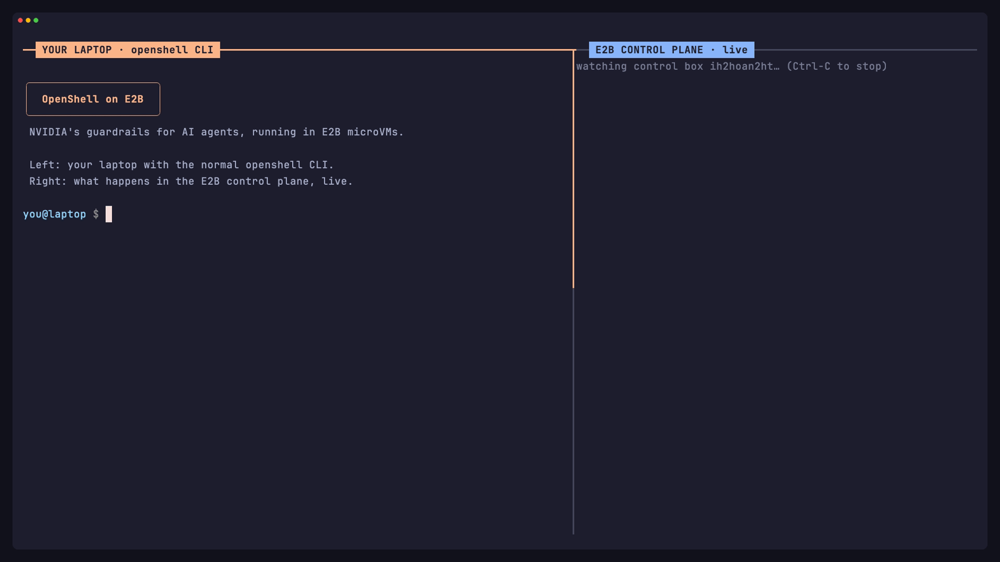

# OpenShell on E2B

An external [NVIDIA OpenShell](https://github.com/NVIDIA/OpenShell) compute driver that runs each agent in its own private E2B microVM. OpenShell confines the agent (network policy per program, HTTP-level rules, audit log); E2B provides the machines.

**Status: working demo, not production.** See [Limits](#limits).



Recorded with [VHS](https://github.com/charmbracelet/vhs) from `media/demo.tape` against a live E2B control plane (`vhs media/demo.tape`).

```
laptop                         E2B control box (private)                       E2B agent box (private, one per sandbox)
openshell CLI ══ tunnel 1 ══►  openshell-gateway (NVIDIA)                       ┌ netns: loopback only ─────────────────┐
  (mTLS inside)                  ↕ unix socket                                  │ openshell-sandbox (NVIDIA, patched)    │
                               openshell-driver-e2b (this repo) ── E2B API ───► │   uid 1500, 0 capabilities, no_new_privs│
                               openshell-supervisor (NVIDIA, patched) ═ tunnel 2 ═► │   └ the agent                         │
                                 policy engine + egress proxy → internet        └────────────────────────────────────────┘
```

- **Tunnels** go through E2B's HTTPS port address: E2B traffic token + random secret path + E2B certificate verification + OpenShell TLS inside, with a 10 s heartbeat.
- **The agent box holds no secrets.** The E2B API key, gateway JWTs and traffic tokens stay in the control box.
- **The driver** is Rust on NVIDIA's own crates (pinned to `v0.1.2`) for the boundary protocol. E2B calls go through `driver/e2b-helper.mjs` (E2B's official JS SDK), because E2B has no Rust SDK.

## Run the demo

Needs `E2B_API_KEY` in `.env`, Node 22+, and the binaries in `.bin/` (`wstunnel`, `openshell` CLI for your OS).

```bash
npm install
npm run connect -- --new     # terminal 1: fresh control box + tunnel (~12 s); keep it running
npm run demo                 # terminal 2: create → isolation → policy → GET 200 / POST 403 → audit → delete
```

Rebuild from source (only after changing the driver or the OpenShell version):

```bash
npm run template:builder     # once: 8 vCPU Rust builder template
npm run build:binaries       # patched NVIDIA binaries + driver → dist/v0.1.2/ (~5 min in E2B)
npm run template:workload    # agent box template
npm run template:control     # control box template
```

## Layout

| Path | What |
|---|---|
| `driver/src/boundary.rs` | Builds OpenShell's `BoundaryConfig` + `SandboxRuntimeDescriptor` and the outer-fence evidence |
| `driver/src/lifecycle.rs` | Create / delete: E2B box, fence check, papers, runtime, tunnel, supervisor |
| `driver/src/service.rs` | The `ComputeDriver` gRPC service |
| `templates/launch-sandbox.sh` | The fence: netns with only loopback, PID ns, uid 1500, zero caps, policy DNS |
| `patches/landlock-abi2.patch` | **Demo-only** patch, see below |
| `scripts/connect.ts` | One-command control plane + CLI tunnel |
| `scripts/demo.sh` | The demo |
| `scripts/watch.ts` | `npm run watch`: live, color-coded control-plane log (driver, gateway, supervisors) |
| `media/demo.tape` | VHS script for the recording |

## Limits

- **Landlock v2 patch.** E2B's guest kernel is Linux 6.1 (Landlock ABI v2). OpenShell v0.1.x requires ABI v3 (kernel ≥ 6.2) so read-only paths can't be truncated. This build accepts v2, so **read-only paths are not protected against truncate**. The real fix is an E2B kernel ≥ 6.2.
- Stop/start (pause/resume) is not implemented. Driver state is in memory only.
- One client certificate is shared by the CLI and supervisors.
- Provisioning isn't cancellation-safe yet (a create interrupted halfway can leave an E2B box until its timeout). Health monitoring and owner-checked state directories are in.
- E2B teams with a 1-hour sandbox cap: the control box dies an hour after creation. Run `npm run connect -- --new` shortly before use.

## License

Apache-2.0. Uses NVIDIA OpenShell (Apache-2.0) and wstunnel (BSD-3-Clause).
